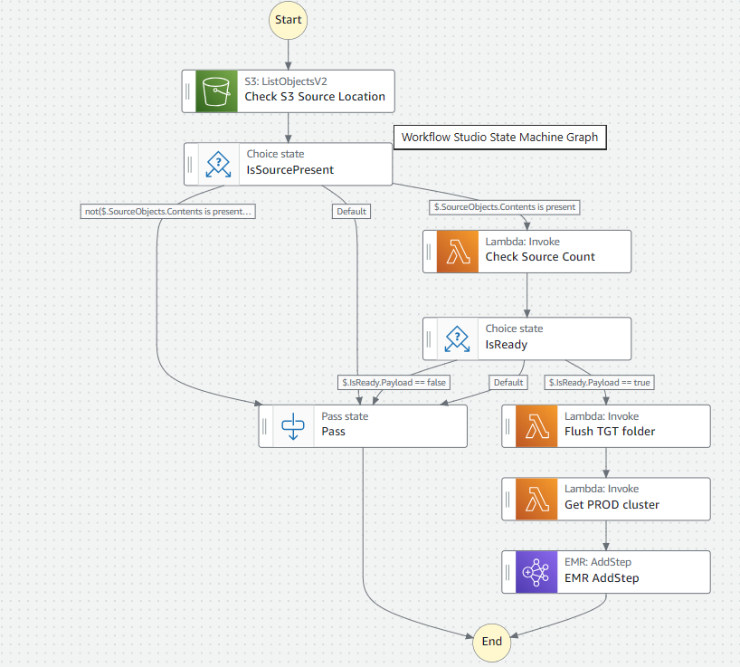

# Course Walkthrough Example Replication Guide

This workflow helps to reproduce final setup of step function with emr cluster.
Course link:  https://www.udemy.com/course/mastering-aws-elastic-map-reduce-for-data-engineers/

## Requirements

* [Create an AWS account](https://portal.aws.amazon.com/gp/aws/developer/registration/index.html) if you do not already have one and log in. The IAM user that you use must have sufficient permissions to make necessary AWS service calls and manage AWS resources.
* [AWS CLI](https://docs.aws.amazon.com/cli/latest/userguide/install-cliv2.html) installed and configured
* [Git Installed](https://git-scm.com/book/en/v2/Getting-Started-Installing-Git)
* [Terraform](https://learn.hashicorp.com/tutorials/terraform/install-cli?in=terraform/aws-get-started) installed
* Create [key pair](https://docs.aws.amazon.com/AWSEC2/latest/UserGuide/create-key-pairs.html) and [elastic-ip](https://docs.aws.amazon.com/AWSEC2/latest/UserGuide/elastic-ip-addresses-eip.html) 

## Deployment Instructions

1. Create a new directory, navigate to that directory in a terminal and clone the GitHub repository:
    ``` 
    git clone https://github.com/aws-samples/step-functions-workflows-collection
    ```
1. From the command line, initialize Terraform project with local backend, creating state bucket and DynamoDb table:
    ```
    terraform init
    terraform apply
    ```
1. Put values for eip_allocation_id, emr_key_name (both previously created) and emr_subnet_id arguments in emr-cluster-module. Subnet can be taken from the default VPC.

1. Uncomment s3 backend section and modules blocks in the main.tf file and rerun init command:
    ```
    terraform init
    ```
1. From the command line, apply the configuration in the main.tf file:
    ```
    terraform apply
    ```
1. During the prompts:
    * Enter yes

## Cloud Infrastructure Overview
EMR cluster gets created with automatic assignment of EIP for primary node, 
to preserve stable SSH connection (thus no need to change address on every startup of cluster).


* Spark application code is stored in __spark-app-tf-__{account_id} bucket
* Source files are stored in __emr-course-tf-__{account_id} bucket (__/landing__ prefix)


Statemachine workflow:


## Testing

Start the workflow with a test event as in the example by below.
```json
{
  "Bucket": "emr-course-tf-${AWS_ACCOUNT_ID}",
  "SourcePrefix": "landing/"
}
```
Replace `${AWS_ACCOUNT_ID}` with the AWS AccountId used to deploy the Terraform template. By default, in the main.tf source prefix is set to 'landing'.

Check that two files were created as a result of step function execution. Using AWS CLI:

```
aws s3 ls s3://emr-course-tf-${AWS_ACCOUNT_ID}/active/year=2021/month=1/dayofmonth=16/

2023-12-07 07:56:31   68835032 part-00000-0f193422-906d-4d82-985f-0a05b8978582.c000.snappy.parquet
2023-12-07 07:56:31   63007568 part-00001-0f193422-906d-4d82-985f-0a05b8978582.c000.snappy.parquet

```

## Cleanup
From root directory of the project: 

1. Delete output files from target directory with AWS CLI command
    ```bash
    aws s3 rm s3://emr-course-tf-${AWS_ACCOUNT_ID}/active/_SUCCESS
    aws s3 rm s3://emr-course-tf-${AWS_ACCOUNT_ID}/active/year=2021/  --recursive
    ```
1. Comment section with s3 backend in the main.tf, to be able to migrate to local one
   ```json
   #   backend "s3" {
   #     bucket         = "terraform-tf-state-${AWS_ACCOUNT_ID}"
   #     key            = "../terraform.tfstate"
   #     region         = "eu-central-1"
   #     dynamodb_table = "terraform-state-locking-${AWS_ACCOUNT_ID}"
   #     encrypt        = true
   #   }
   ```

1. Switch to using local backend
   ```bash
   terraform init --migrate-state
   ```

1. Delete all created resources
    ```bash
    terraform destroy
    ```
1. During the prompts:
    * Enter yes

1. Confirm all created resources has been deleted
    ```bash
    terraform show
    ```


